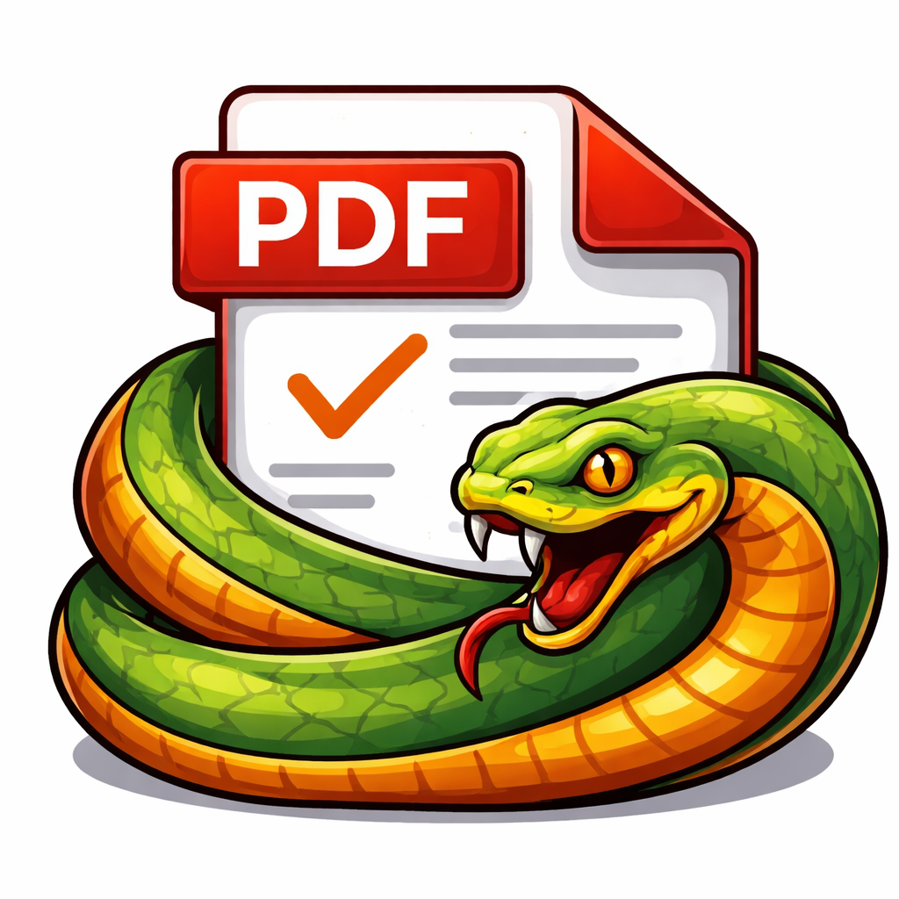

# 📄 MambaPDF

<p align="center">
  
</p>

<p align="center">
  <strong>Generá órdenes de trabajo profesionales desde tu dispositivo Android.</strong>
</p>

<p align="center">
  Aplicación desarrollada con <b>React Native</b> y <b>Expo</b> para crear plantillas personalizadas, completar órdenes de trabajo y generar documentos PDF completamente configurables, incluso sin conexión a Internet.
</p>

---

## 📱 ¿Qué es MambaPDF?

**MambaPDF** es una aplicación para Android diseñada para simplificar la creación de órdenes de trabajo en formato PDF, permitiendo generar documentos profesionales de forma rápida y completamente offline.

Está pensada para emprendedores, técnicos, profesionales y empresas de cualquier tamaño que necesitan generar documentación desde el lugar donde realizan su trabajo. Si no contás con una notebook o simplemente preferís la comodidad de hacerlo todo desde tu teléfono, **MambaPDF es la herramienta ideal para vos.**

---

## ✨ Características

- 📄 Generación automática de órdenes de trabajo en PDF.
- 📝 Creación de plantillas totalmente personalizables.
- 📂 Organización mediante secciones y campos dinámicos.
- 📅 Soporte para distintos tipos de campos:
  - Texto
  - Fecha
  - Sí / No
  - Selección de opciones
- 🏢 Configuración de la empresa:
  - Logo
  - Nombre
  - Dirección
  - Teléfono
  - Correo electrónico
- ✍️ Firma personalizada.
- 🌊 Marca de agua opcional.
- 🚫 Posibilidad de ocultar las firmas en los PDFs.
- 📱 Funcionamiento completamente **offline**.
- 📤 Compartir los documentos PDF generados desde el dispositivo.

---

## 🛠️ Tecnologías utilizadas

- React Native
- Expo
- JavaScript (ES6+)
- React Navigation
- AsyncStorage
- Expo Print
- Expo Sharing
- Expo FileSystem
- HTML + CSS para la generación dinámica de PDFs

---

## 📄 Generación de PDF

Cada documento generado puede personalizarse mediante la configuración integrada en la aplicación.

Entre las opciones disponibles se encuentran:

- Logo de la empresa.
- Nombre de la empresa.
- Datos de contacto.
- Firma del responsable.
- Marca de agua.
- Pie de página personalizado.
- Activar o desactivar las firmas.

Los PDFs se generan automáticamente respetando la estructura definida por la plantilla seleccionada.

---

## 📂 Estructura del proyecto

```text
src/
│
├── components/
├── navigation/
├── screens/
├── services/
├── storage/
├── assets/
└── utils/
```

---

## 🎯 Objetivos del proyecto

Este proyecto fue desarrollado con el objetivo de:

- Facilitar la generación de órdenes de trabajo desde dispositivos móviles.
- Eliminar la dependencia de una computadora para emitir documentación profesional.
- Ofrecer una solución simple, rápida y completamente offline.
- Aplicar buenas prácticas de desarrollo con React Native y Expo.

---

## 📥 Descargar la aplicación

La última versión disponible puede descargarse desde la página oficial del proyecto:

🌐 **[https://mambapdf.vercel.app](https://mambapdf-web.vercel.app/)**

---

## 👨‍💻 Autor

**Lucas Gaitón**

Estudiante de Licenciatura en Sistemas • Full Stack Developer

- GitHub: https://github.com/LucasGaiton
- LinkedIn: https://www.linkedin.com/in/lucasgaiton/

---

## ⭐ ¿Te gustó el proyecto?

Si MambaPDF te resultó útil o interesante, no olvides dejar una **⭐ Star** en este repositorio.

¡Toda sugerencia o contribución es bienvenida!
